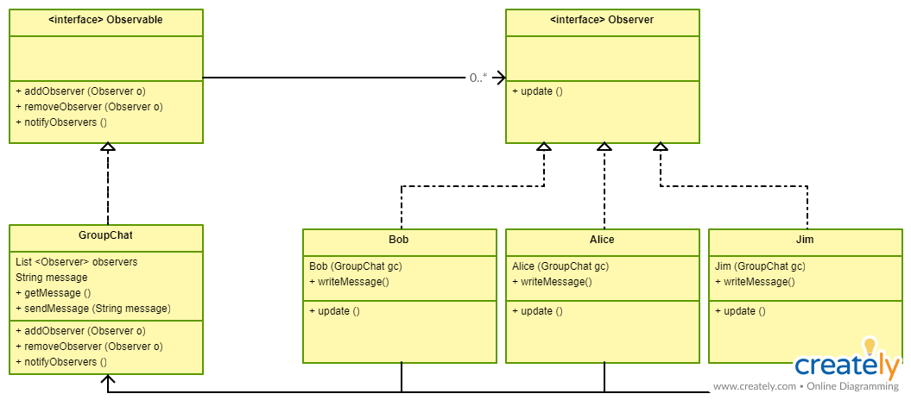

## Intent
Define a one-to-many dependency between objects so that when one object changes state, all its dependents are notified and updated automatically.

**Programmatic Example**

Let's consider that we want to create group chat. Chat can have many participants and each of them may write a message. When a message is written by user A, other users should be able to see it.

There can be a few different implementations of Observer pattern. It's up to the problem and developer which one is choosen.

In our example, the UML diagram looks as following:


Simply, we have two interfaces: Observable and Observer that defines basic operations
```
public interface Observable {
	void addObserver(Observer observer);
	void removeObserver(Observer observer);
	void notifyObservers();
}

public interface Observer {
	void update();
}
```
Group chat implements Observable interface and adds 'state' to application. Here state is represented by message.
```
public class GroupChat implements Observable {

	private static final Logger LOGGER = LoggerFactory.getLogger(GroupChat.class);
	private List<Observer> observers;
	private String message;

	public GroupChat() {
		LOGGER.info("Group chat is created");
		observers = new ArrayList<>();
	}

	public String getMessage() {
		return message;
	}

	public void sendMessage(String message) {
		this.message = message;
		notifyObservers();
	}

	@Override
	public void addObserver(Observer observer) {
		LOGGER.info("{} added to the group", observer);
		this.observers.add(observer);
	}

	@Override
	public void removeObserver(Observer observer) {
		LOGGER.info("{} left the group", observer);
		this.observers.remove(observer);
	}

	@Override
	public void notifyObservers() {
		this.observers.forEach(Observer::update);
	}
}
```
Each of concreate observers, implements Observer interface and additionally defines a method to write new message. The code for one concreate observer is shown below.
```
public class Jim implements Observer {

	private static final Logger LOGGER = LoggerFactory.getLogger(Jim.class);
	private GroupChat groupChat;

	Jim(GroupChat groupChat) {
		this.groupChat =
		this.groupChat.addObserver(this);
	}

	@Override
	public void update() {
		String message = groupChat.getMessage();
		LOGGER.info("Jim received message: {}", message);
	}

	void writeMessage(String message) {
		LOGGER.info("Jim writes a message: {}", message);
		groupChat.sendMessage(message);
	}

	@Override
	public String toString() {
		return "Jim";
	}
}
```
Now, we can easily run our program
```
GroupChat groupChat = new GroupChat();

Bob bob = new Bob(groupChat);
Alice alice = new Alice(groupChat);
Jim jim = new Jim(groupChat);

bob.writeMessage("Hi! I'm Bob!");
alice.writeMessage("Hi Bob! Alice here ;)");
jim.writeMessage("Who added me to this group?!");
groupChat.removeObserver(jim);
alice.writeMessage("Someone's mad :D");

// output
Group chat is created
Bob added to the group
Alice added to the group
Jim added to the group
Bob writes a message: Hi! I'm Bob!
Bob received message: Hi! I'm Bob!
Alice received message: Hi! I'm Bob!
Jim received message: Hi! I'm Bob!
Alice writes a message: Hi Bob! Alice here ;)
Bob received message: Hi Bob! Alice here ;)
Alice received message: Hi Bob! Alice here ;)
Jim received message: Hi Bob! Alice here ;)
Jim writes a message: Who added me to this group?!
Bob received message: Who added me to this group?!
Alice received message: Who added me to this group?!
Jim received message: Who added me to this group?!
Jim left the group
Alice writes a message: Someone's mad :D
Bob received message: Someone's mad :D
Alice received message: Someone's mad :D
```


## Private notes
It's an easy pattern and you can find many examples that says how, where and when to use the Observer. The above example is very trivial and not entirely correct, but from the point of view of understanding, I think it's good and you'll get what is the Observer's goal.
